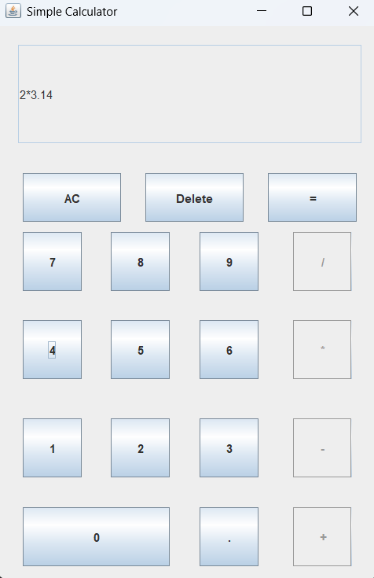

# Simple Calculator using Java

A simple calculator application developed in Java using the Swing framework. This project emphasizes clean architecture, robust input handling, and a refined user experience for performing fundamental arithmetic operations.

---

## Features

- **Arithmetic Support**: Handles addition, subtraction, multiplication, and division with accurate evaluation.
- **Input Validation**:
  - Manages division by zero with clear error feedback
  - Prevents invalid expressions such as starting with an operator
  - Restricts multiple decimal points within a single numeric token
- **Error State Recovery**: Blocks further input on error and resumes only after explicit user correction.
- **Smart Delete Logic**: Re-enables operator buttons when an operator is removed from input.
- **Component Modularity**: Button actions are encapsulated in reusable helper methods for better maintainability.

---

## Technologies Used

- **Language**: Java (JDK 8 or higher)
- **User Interface**: Java Swing
- **Development Environment**: Visual Studio Code

---

## Calculator Interface

